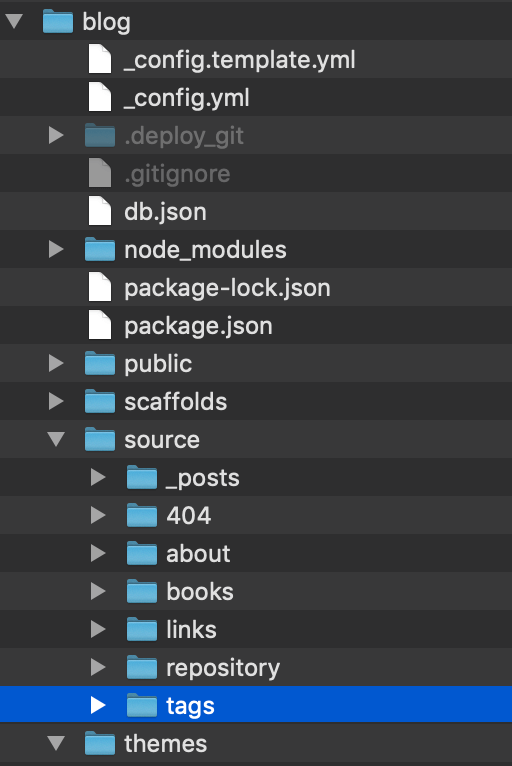

选择GitHub Page的原因是**比其他平台爽！** 且免费，还能拥有自己独立门户！大家用过其他平台的都不少有吐槽的地方吧？说说我搭建的过程和思路。

选择套餐（Mac平台）：

> Github Page + Hexo（[主题](https://hexo.io/themes/)：[pure](https://github.com/cofess/hexo-theme-pure)；插件：hexo-image-link）+ [Typory](https://typora.io/)

（1）[搭建GitHub Pages 和 Hexo](https://zhuanlan.zhihu.com/p/114195340) ，注意点：①仓库名必须为：昵称.github.io`，访问时是：https://昵称.github.io作为首页。②主题选择下面（2）的。

（2）[Hexo主题选择hexo-theme-pure](https://github.com/cofess/hexo-theme-pure)，注意：①路径复制到的目录应该是下图位置；②categories文章分类并不会合并，所以我只用tags。

（3）[使用Hexo插件hexo-image-link解决图片问题，以及Typory工具写markdown文章](https://cloud.tencent.com/developer/article/1600295)

#### 记录hexo的几个关键命令：

（1）删除自动生成的文件

> hexo clean

（2）生成网页等文件

> hexo g

（3）开启预览服务，浏览器中输入：http://localhost:4000/

> hexo s

（4）更新到github仓库

> hexo d

#### nmp代理
（1）方式一：安装cnpm镜像代理；安装后使用 cnpm命令代替cpm
> npm install -g cnpm --registry=https://registry.npm.taobao.org

> cnpm install -g @angular/cli

（2）方式二：
> npm config set registry https://registry.npm.taobao.org