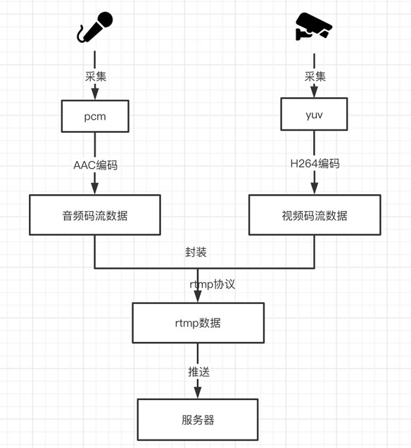

**本系列介绍了rtmp直播推流全过程** [完整的项目地址](https://github.com/xhunmon/RtmpPush)

以下文章是针对每一个情况，介绍音视频相关知识，以及实现的原理，总共分五章：

- 第一章：[直播推流全过程：视频数据源之YUV（1）](https://qincji.gitee.io/2020/12/03/rtmppush/1-yuv/)

  RGB或YUV 组成一张画面，很多个的画面就可以组成一个视频，而在视频编解码领域中YUV则是这一切的基础。
  

- 第二章：[直播推流全过程：音频数据源之PCM（2）](https://qincji.gitee.io/2020/12/04/rtmppush/2-pcm/)

  音频处理就是对声音特性采集成数字信号后进行处理，而PCM则是最原始采集到的数据，称“裸流”。

  

- 第三章：[直播推流全过程：视频编码之H.264（3）](https://qincji.gitee.io/2020/12/06/rtmppush/3-h264/)

  为了减少视频大小，以及改善网络传输，H.264编码在网络传输中可是非常重要。
  
  
- 第四章：[直播推流全过程：音频编码之AAC（4）](https://qincji.gitee.io/2020/12/07/rtmppush/4-aac/)

  acc编码是音频公认的主流编码。
  
  
- 第五章：[直播推流全过程：直播推流编码之RTMP（5）](https://qincji.gitee.io/2020/12/08/rtmppush/5-rtmp/)

  结合rtmp分块的特性，把数据较大的视频数据进行分块传输，这必定是直播界的宠儿！

